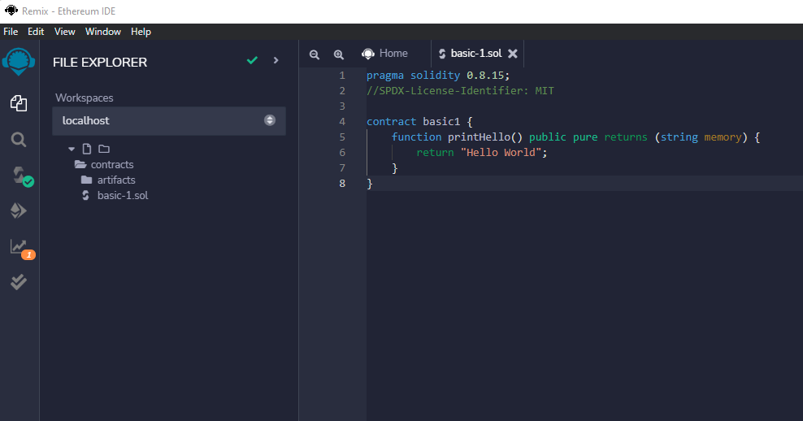
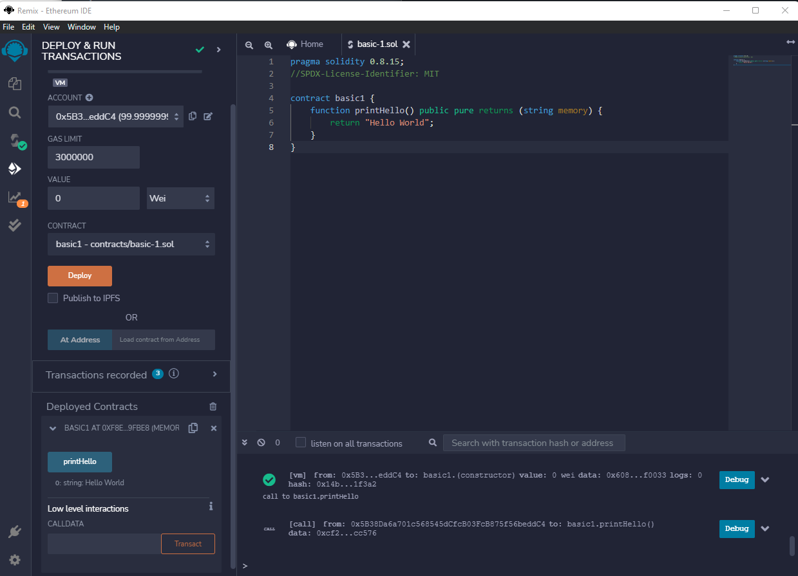

## Basic 1 Project - Solidity Contracts

### Problem Statement

- Write a contract with 1 function which prints a string "Hello World!".
- Printing should not involve any gas.

### Hints

"hints" folder has hint

### Solution

"contracts" folder has the solutions.

### Screenshots

