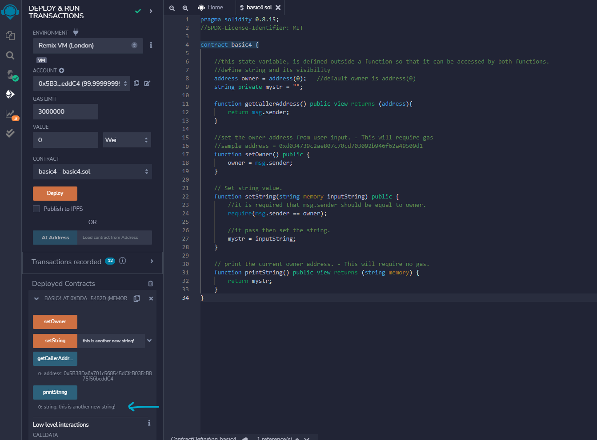

## LEVEL 1
## Contract 4 Project - Visibility of State Variable

### Problem Statement

- Write a contract 'Owner' which has a function that sets the owner address to anyone that calls the function. (this is a bad practice, but included just for learning)
- And also emit an event on success.
- Create another function that can set a string value. But only the owner of the contract is allowed to set the string's value.
- Test if address (account/user) other than the current owner can change the string.
- It should also have a function that tell the anyone about the current owner address of the contract.
- It should also have a function that tell anyone about what is the value of the string is.

### Hints

"hints" folder has hint

### Solution

"contracts" folder has the solutions.

### Screenshots

