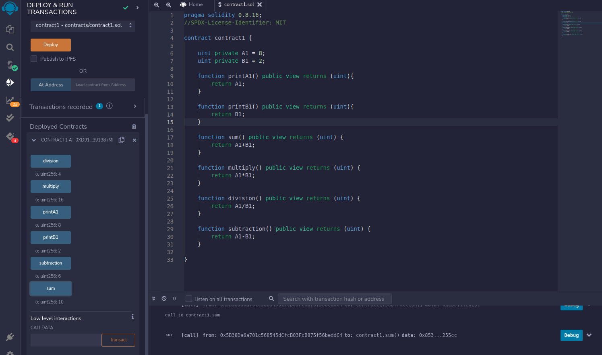

## LEVEL 2

## Contract 1 Project - Calculator (without gas consumption)

### Problem Statement

- Write a contract which has a function that prints 2 hardcoded integers (A1, B1) greater than 1 without gas consumption
- Another function to find the sum of these 2 integers (A1 + B1) without gas consumption
- Another function to find the multiplication of these 2 integers (A1 x B1) without gas consumption
- Another function to find the division of these 2 integers (A1 / B1) without gas consumption
- Another function to find the subtraction of these two integers (A1 - B1) without gas consumption

### Hints

Not required.

### Solution

"contracts" folder has the solutions.

### Screenshots

