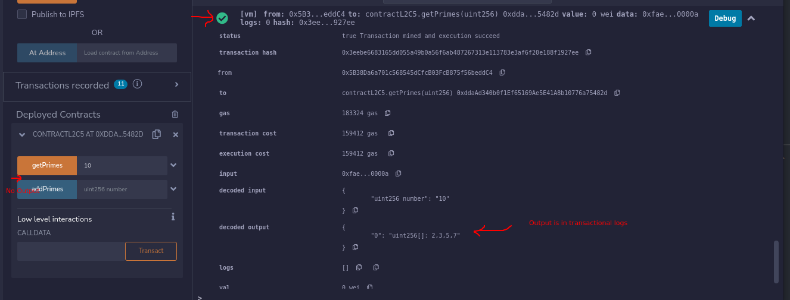

## Informational Hint

Use Prime Number contract function privately.

### Direct Return value vs Transactional log return value.

Direct Return value: If a function is with either `pure`/`view` mutability, then we can get the returned variable directly as.

```
function functionCall() public view returns (uint) {
    return 1;
}

uint val = functionCall();
```

Transactional log return value: If a function is not with either `pure`/`view` mutability, then we cannot get direct return value. We need to query the transaction data.



### State change defined outside a function.

Ref: https://stackoverflow.com/questions/71952469/array-push-throwing-parsererror-expected-identifier-but-got

```js
pragma solidity ^0.8.16;
//SPDX-License-Identifier: MIT

// Creating a contract
contract Types {

    // Defining the array
    uint[] data = [10, 20, 30, 40, 50];

    //this is invalid. Check the hints page for more details.
    data.push(55);  //This line will give you compilation error. Comment/Remove this line before compilation.

    // Defining the function to push
    // values to the array
    function array_push(
    ) public returns(uint[] memory){
        //this is valid.
        data.push(60);
        data.push(70);
        data.push(80);

        return data;
    }
}
```

- All operation in Solidity that change the state about your contract or read some variables you must to write into a function.
- In this case, because you are modifying a value about state variable, you must to put the statement above into function

### Array types

Ref: https://www.geeksforgeeks.org/solidity-arrays/

1. Fixed size array

2. Dynamic array

### Array Members

- `length`

Arrays have a length member that contains their number of elements. The length of memory arrays is fixed (but dynamic, i.e. it can depend on runtime parameters) once they are created.

- `push()`

Dynamic storage arrays and bytes (not string) have a member function called push() that you can use to append a zero-initialised element at the end of the array. It returns a reference to the element, so that it can be used like x.push().t = 2 or x.push() = b.

- `push(x)`

Dynamic storage arrays and bytes (not string) have a member function called push(x) that you can use to append a given element at the end of the array. The function returns nothing.

- `pop`

Dynamic storage arrays and bytes (not string) have a member function called pop that you can use to remove an element from the end of the array. This also implicitly calls delete on the removed element.

Know more about Array in Solidity here: https://solidity.readthedocs.io/en/latest/types.html#arrays
