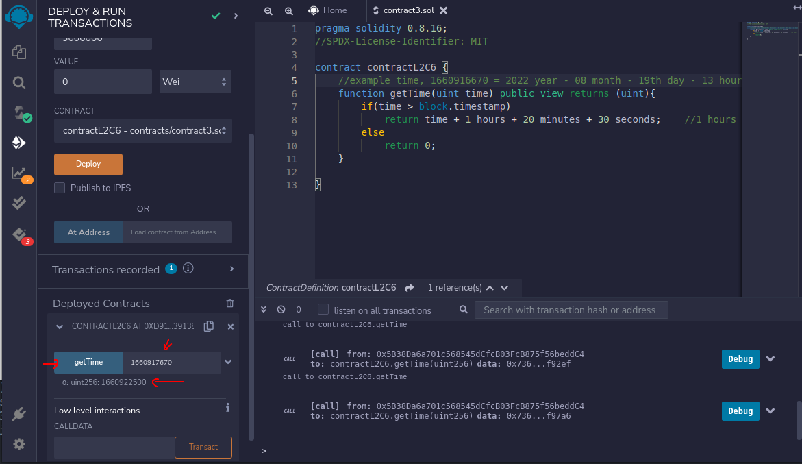

## LEVEL 2

## Contract 5 Project - Time

## Problem Statement

Write a contract which implements a function named `getTime()`.

`getTime()` accepts a Unix timestamp (number of seconds since 1970-01-01 00:00:00 GMT). Method will check if this timestamp exists after the current time. If yes, it will return a timestamp after 1 hour, 20 minutes and 30 seconds from passed time else return 0.

### Hints

"hints" folder has hint

### Solution

"contracts" folder has the solutions.

### Screenshots

