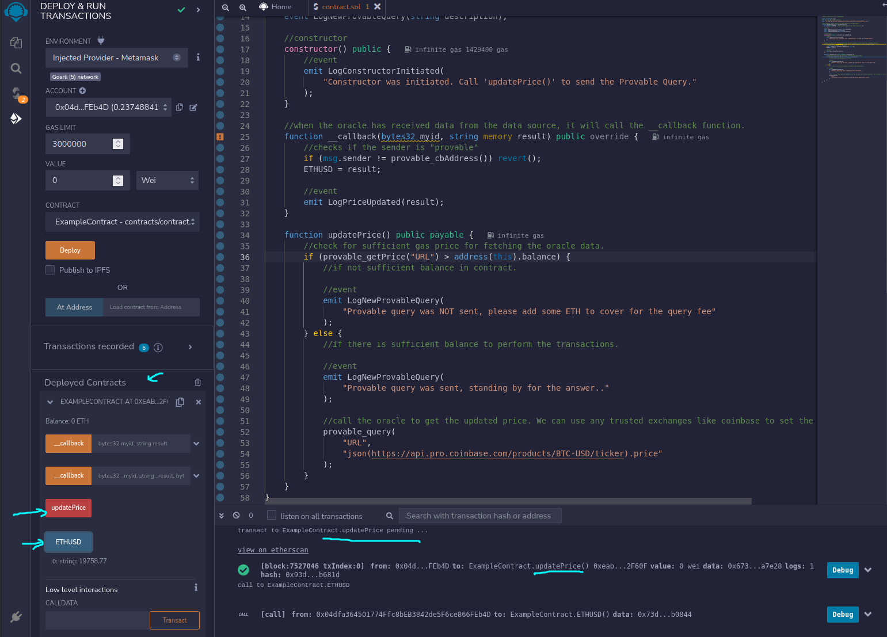
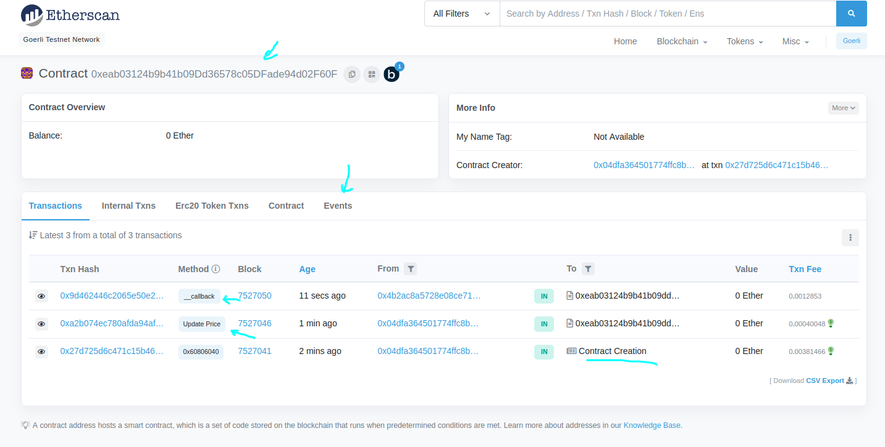
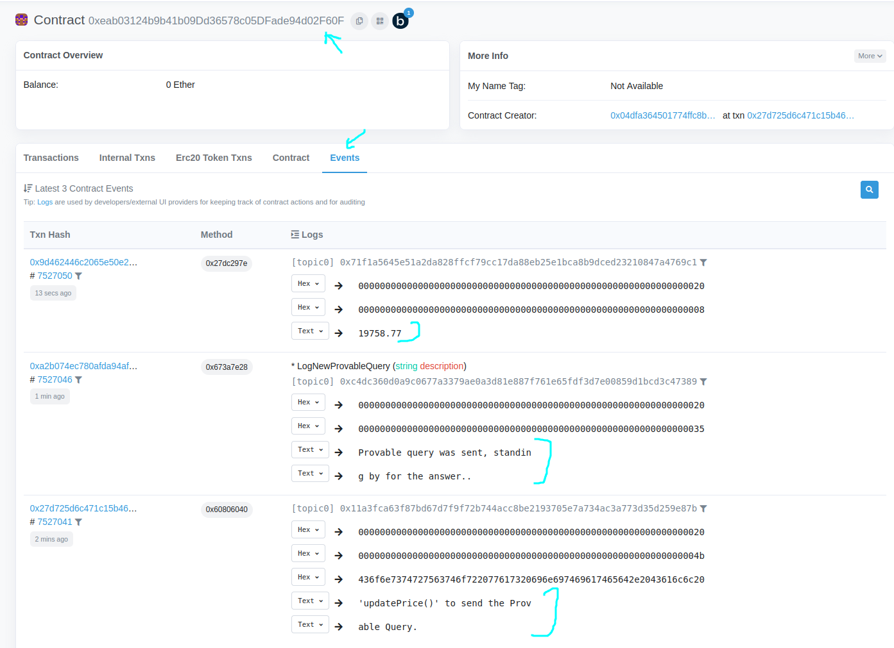

## Instructions

- To run `example1.sol` you will need some ether on either ethereum testnet like Ropsten or Goerli, or in mainnet.
- We cannot use the latest version of solidity for provable oracle. We can go as high as version 0.6.12.
- Open remix ide using browser. Before deploying the contract in remix, first connect to the metasmask account to any ethereum network (ropsten, goerli, mainnet).
- make sure the account have faucet.
- Select the provider "inject provider" during deployment, this will automatically fetch the metamask account.

