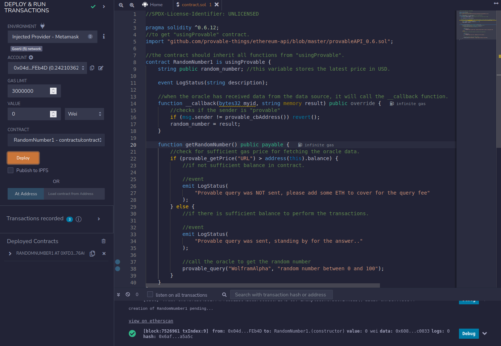
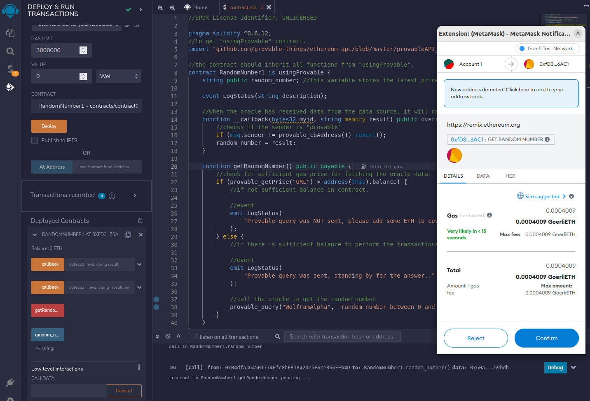
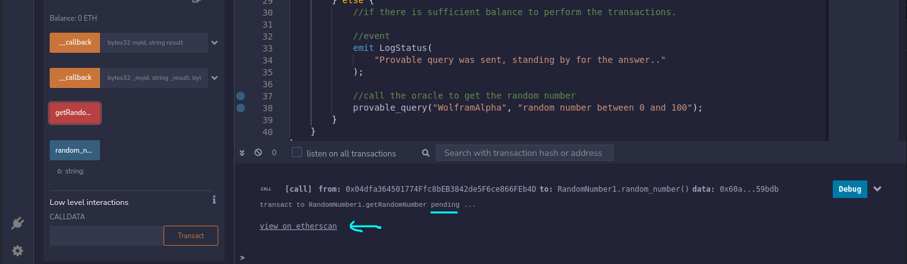
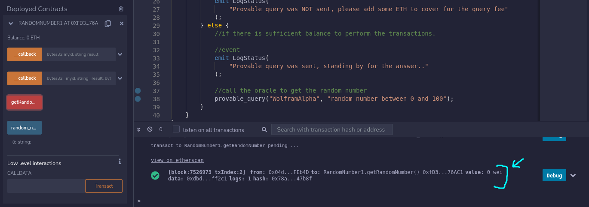
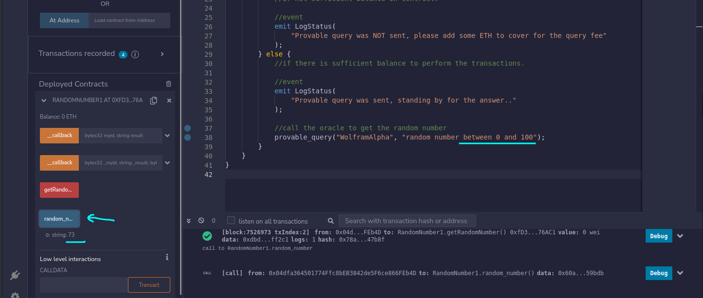
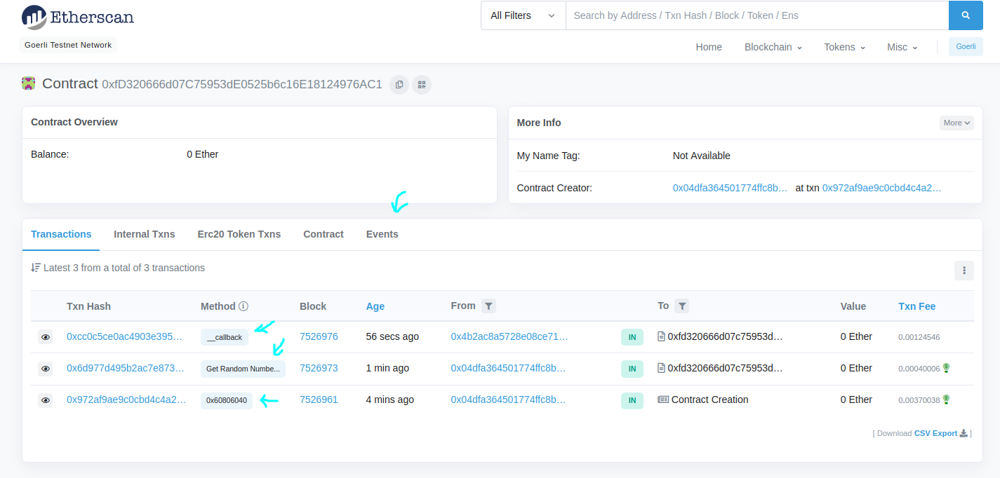

## Introduction

This contract fetches a random number between 0 to 100 using the **WolframAlpha formula** via the Provable Oracle.
After you call the getRandomNumber() function, the Provable Oracle sends the execution flow to the Provable servers and the server then fetches a random number between 0 and 100.
After fetching the random number, the execution flow returns back to the contract, the Provable servers call the contract's `__callback()` function. (You can see this in the etherscan transactions also)

## Instructions

- To run `example1.sol` you will need some ether on either ethereum testnet like Ropsten or Goerli, or in mainnet.
- We cannot use the latest version of solidity for provable oracle. We can go as high as version 0.6.12.
- Open remix ide using browser. Before deploying the contract in remix, first connect to the metamask account to any ethereum network (ropsten, goerli, mainnet).
- make sure the account have faucet.
- Select the provider "inject provider" during deployment, this will automatically fetch the metamask account.

