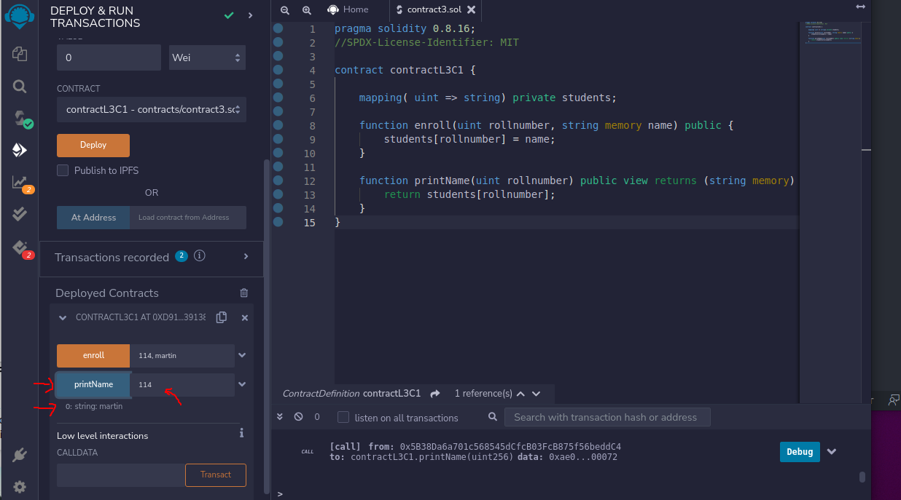

## LEVEL 3

## Contract 1 Project - Student

## Problem Statement

Write a contract which implements a function named `enroll()`.

`enroll()` takes student roll number (uint) and student name (string) as parameters and store them in a one to one mapping. Also emit en event on success with student roll number.

### Hints

"hints" folder has hint

### Solution

"contracts" folder has the solutions.

### Screenshots

