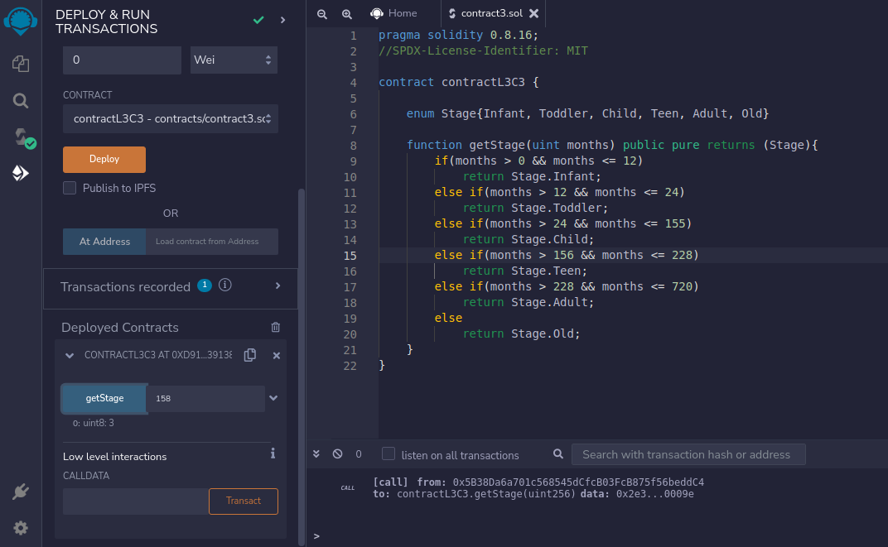

## LEVEL 3

## Contract 3 Project - Lifecycle

Write a function `getStage()`, which should take no. of months as a parameter and return the user its lifecycle stage index (0, 1, 2, 3, 4, 5). Stages can be:

0 - Infant (<1 year)
1 - Toddler (1-2 years)
2 - Child (3-12 years)
3 - TeenAger (13-19 years)
4 - Adult (20-60 years, just accept it :grimacing:)
5 - Old (>60 years)

Use `enum` for stage listing. This problem can be solved using the regular conditional logic, but the intention of this task is to use `enum`.

### Hints

"hints" folder has hint

### Solution

"contracts" folder has the solutions.

### Screenshots

